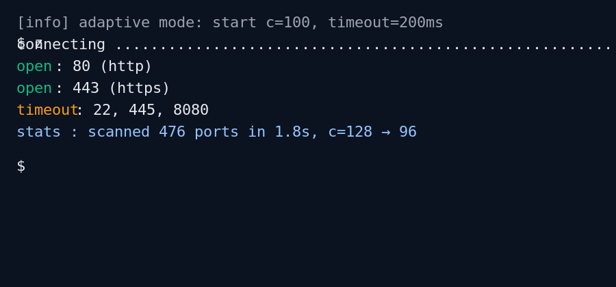

# ZigScan - High-Performance Port Scanner

[](https://github.com/gnusec/zigscan/actions/workflows/ci.yml)
[](https://github.com/gnusec/zigscan/actions/workflows/release.yml)
[](LICENSE)
[](https://github.com/gnusec/zigscan/releases/latest)

> One static binary. Fast scans. Hacker-friendly defaults.

A high-performance port scanner written in Zig, similar to RustScan, designed for fast and efficient network port scanning.

### 10s Quick Demo

<p align="center">
  
  <br/>
  <sub>Prefer GIF for compatibility. SVG version: <a href="assets/cli-demo.svg">assets/cli-demo.svg</a></sub>

</p>

## ⚡ Quick Start

Install in 10s (example for Linux x86_64 musl):

```bash
curl -L https://github.com/gnusec/zigscan/releases/download/v0.1.3/zigscan-x86_64-linux-musl.tar.gz \
  | tar xz && ./zigscan-x86_64-linux-musl/zigscan --help
```

### Downloads (v0.1.3)

Note:
- Archives and direct binaries are provided for stable targets.

Stable builds (static preferred, dynamic fallback when required):

| OS | Arch | Libc | Target | Archive | Binary |
|---|---|---|---|---|---|
| Linux | x86_64 | glibc | x86_64-linux-gnu | https://github.com/gnusec/zigscan/releases/download/v0.1.3/zigscan-x86_64-linux-gnu.tar.gz | https://github.com/gnusec/zigscan/releases/download/v0.1.3/zigscan-x86_64-linux-gnu |
| Linux | aarch64 | glibc | aarch64-linux-gnu | https://github.com/gnusec/zigscan/releases/download/v0.1.3/zigscan-aarch64-linux-gnu.tar.gz | https://github.com/gnusec/zigscan/releases/download/v0.1.3/zigscan-aarch64-linux-gnu |
| Linux | armv7 (armhf) | glibc | arm-linux-gnueabihf | https://github.com/gnusec/zigscan/releases/download/v0.1.3/zigscan-arm-linux-gnueabihf.tar.gz | https://github.com/gnusec/zigscan/releases/download/v0.1.3/zigscan-arm-linux-gnueabihf |
| Linux | x86 (i386) | glibc | x86-linux-gnu | https://github.com/gnusec/zigscan/releases/download/v0.1.3/zigscan-x86-linux-gnu.tar.gz | https://github.com/gnusec/zigscan/releases/download/v0.1.3/zigscan-x86-linux-gnu |
| Linux | riscv64 | glibc | riscv64-linux-gnu | https://github.com/gnusec/zigscan/releases/download/v0.1.3/zigscan-riscv64-linux-gnu.tar.gz | https://github.com/gnusec/zigscan/releases/download/v0.1.3/zigscan-riscv64-linux-gnu |
| Linux | x86_64 | musl | x86_64-linux-musl | https://github.com/gnusec/zigscan/releases/download/v0.1.3/zigscan-x86_64-linux-musl.tar.gz | https://github.com/gnusec/zigscan/releases/download/v0.1.3/zigscan-x86_64-linux-musl |
| Linux | aarch64 | musl | aarch64-linux-musl | https://github.com/gnusec/zigscan/releases/download/v0.1.3/zigscan-aarch64-linux-musl.tar.gz | https://github.com/gnusec/zigscan/releases/download/v0.1.3/zigscan-aarch64-linux-musl |
| macOS | x86_64 | - | x86_64-macos | https://github.com/gnusec/zigscan/releases/download/v0.1.3/zigscan-x86_64-macos.tar.gz | https://github.com/gnusec/zigscan/releases/download/v0.1.3/zigscan-x86_64-macos |
| macOS | aarch64 (Apple Silicon) | - | aarch64-macos | https://github.com/gnusec/zigscan/releases/download/v0.1.3/zigscan-aarch64-macos.tar.gz | https://github.com/gnusec/zigscan/releases/download/v0.1.3/zigscan-aarch64-macos |

Experimental builds (allowed to fail in CI; availability may vary). Windows is temporarily paused; we’ll bring it back later.

#### Experimental Downloads (v0.1.3)

| OS | Arch | Libc | Target | Archive | Binary |
|---|---|---|---|---|---|
| Linux | loongarch64 | glibc | loongarch64-linux-gnu | https://github.com/gnusec/zigscan/releases/download/v0.1.3/zigscan-loongarch64-linux-gnu.tar.gz | https://github.com/gnusec/zigscan/releases/download/v0.1.3/zigscan-loongarch64-linux-gnu |
| Linux | powerpc64le | glibc | powerpc64le-linux-gnu | https://github.com/gnusec/zigscan/releases/download/v0.1.3/zigscan-powerpc64le-linux-gnu.tar.gz | https://github.com/gnusec/zigscan/releases/download/v0.1.3/zigscan-powerpc64le-linux-gnu |
| Linux | s390x | glibc | s390x-linux-gnu | https://github.com/gnusec/zigscan/releases/download/v0.1.3/zigscan-s390x-linux-gnu.tar.gz | https://github.com/gnusec/zigscan/releases/download/v0.1.3/zigscan-s390x-linux-gnu |
| Linux | riscv32 | glibc | riscv32-linux-gnu | https://github.com/gnusec/zigscan/releases/download/v0.1.3/zigscan-riscv32-linux-gnu.tar.gz | https://github.com/gnusec/zigscan/releases/download/v0.1.3/zigscan-riscv32-linux-gnu |
| Linux | riscv64 | musl | riscv64-linux-musl | https://github.com/gnusec/zigscan/releases/download/v0.1.3/zigscan-riscv64-linux-musl.tar.gz | https://github.com/gnusec/zigscan/releases/download/v0.1.3/zigscan-riscv64-linux-musl |
| Linux | armv7 (armhf) | musl | arm-linux-musleabihf | https://github.com/gnusec/zigscan/releases/download/v0.1.3/zigscan-arm-linux-musleabihf.tar.gz | https://github.com/gnusec/zigscan/releases/download/v0.1.3/zigscan-arm-linux-musleabihf |

### Build from Source

Requirements:
- Zig 0.16 (nightly, master)

```bash
git clone https://github.com/gnusec/zigscan.git
cd zigscan
zig build
./zig-out/bin/zigscan --help
```

## 🚀 Examples

Quick examples; see more in [USAGE.md](USAGE.md):

```bash
# Scan specific ports
zigscan -t 192.168.1.1 -p 80,443,8080
# 说明：对目标 192.168.1.1 的 80、443、8080 端口进行扫描

# Scan a port range
zigscan -t scanme.nmap.org -r 1-1000
# 说明：扫描 1-1000 的连续端口范围

# JSON output saved to file
zigscan -t 103.235.46.115 -p 22,80,443 --json -o results.json
# 说明：输出 JSON 格式并保存到 results.json

# 控制并发（越大越快，但占用更多资源）
zigscan -t 103.235.46.115 -r 1-200 -c 200
# 说明：并发数设置为 200，加快扫描速度

# 自定义超时（毫秒）
zigscan -t 103.235.46.115 -p 22,80,443 --timeout 300
# 说明：将连接超时设置为 300ms，缩短对关闭端口的等待时间
```

## 📖 Help（完整帮助）

执行：

```bash
zigscan --help
```

输出：

```
ZigScan - High-performance Port Scanner
Version: 0.1.3

Usage: zigscan [options]

Options:
  -h, --help              Show this help message
  -t, --target <IP>       Target IP address or hostname (required)
  -T, --targets <file>    File containing list of target IPs
  -p, --ports <ports>     Port list (e.g., 80,443,8080)
  -r, --range <range>     Port range (e.g., 1-1000)
  -c, --concurrency <n>   Number of concurrent connections (default: 500)
  --timeout <ms>          Connection timeout in milliseconds (default: 1000)
  --json                  Output results in JSON format
  --txt                   Output results in TXT format
  -o, --output <file>     Output file path

Examples:
  zigscan -t 192.168.1.1 -p 80,443,8080
  zigscan -t 103.235.46.115 -r 1-1000 -c 100
  zigscan -t scanme.nmap.org -p 22,80,443 --json -o results.json
```

## 🔧 Zig 编译器版本

建议使用最新 Zig 编译器进行构建，下载地址：
- 官方下载页：https://ziglang.org/download/
- 示例（Linux x86_64 开发版）：https://ziglang.org/builds/zig-x86_64-linux-0.16.0-dev.699+529aa9f27.tar.xz


